```mermaid
classDiagram
    direction TB

    class FirebaseIdentity {
        <<external boundary - not persisted>>
        +String uid
        +String email
        +bool emailVerified
        +String providerId
        +getIdToken() String
        +sendEmailVerification() void
        +sendPasswordResetEmail() void
    }

    class Learner {
        <<aggregate root>>
        +int id
        +String firebaseUid
        +String email
        +String name
        +String avatar
        +DateTime emailVerifiedAt
        +AccountStatus status
        +UserRole role
        +ConsentStatus consentStatus
        +DateTime lastActiveAt
        +isMinor() bool
        +isActivated() bool
        +isUsable() bool
        +needsOnboarding() bool
        +isStaff() bool
        +hasPermission(Permission) bool
    }

    class LearnerStats {
        +int xp
        +int streakDays
        +int firstTryCorrect
        +Date lastActivityDate
        +currentLevel() Level
        +levelProgress() double
        +xpToNextLevel() int
        +courseProgress() double
        +recordActivity(Date) void
    }

    class Preferences {
        +ThemeMode themeMode
        +String locale
        +bool reduceMotion
        +bool dailyReminder
    }

    class GuardianConsent {
        +int id
        +String guardianEmail
        +ConsentStatus status
        +String token
        +bool isCurrent
        +DateTime requestedAt
        +DateTime respondedAt
        +isPending() bool
        +grant() void
        +decline() void
    }

    class Grade {
        <<lookup>>
        +String code
        +String label
        +bool isMinor
    }

    class Interest {
        <<lookup>>
        +String name
        +String iconKey
    }

    class Level {
        <<lookup>>
        +int levelNo
        +int minXp
        +String title
    }

    class Module {
        +int id
        +String slug
        +String title
        +String titleKm
        +String description
        +String iconKey
        +int sortOrder
        +DateTime publishedAt
        +isPublished() bool
        +lessonCount() int
        +totalMinutes() int
        +isLockedFor(Learner) bool
        +unlockRequirement(Learner) String
    }

    class Lesson {
        +int id
        +String slug
        +String title
        +String titleKm
        +String summary
        +int minutes
        +int xp
        +int sortOrder
        +bool isProject
        +DateTime publishedAt
        +isPublished() bool
        +stepCount() int
        +totalXp() int
    }

    class LessonStep {
        +int stepIndex
        +StepKind kind
        +String title
        +String body
        +String bodyKm
        +String language
    }

    class LessonStepItem {
        +int position
        +String label
    }

    class Challenge {
        +int id
        +ChallengeKind kind
        +String prompt
        +String answer
        +String hint
        +String code
        +int xp
        +grade(String submission) bool
    }

    class ChallengeOption {
        +int position
        +String label
        +bool isCorrect
    }

    class LessonProgress {
        +int lastStepIndex
        +DateTime completedAt
        +isCompleted() bool
        +isResumable() bool
    }

    class LessonAttempt {
        <<immutable record>>
        +int id
        +String lessonTitleSnapshot
        +String moduleTitleSnapshot
        +int xpEarned
        +int attempts
        +bool passed
        +DateTime completedAt
        +firstTry() bool
    }

    class Badge {
        +int id
        +String slug
        +String name
        +String description
        +String iconKey
        +String requirementText
        +BadgeCriteriaType criteriaType
        +Map criteriaParams
        +isEarnedBy(Learner) bool
    }

    class BadgeAward {
        <<association class>>
        +DateTime earnedAt
    }

    class SyncEvent {
        +String clientEventUuid
        +SyncEventType eventType
        +Map payload
        +DateTime occurredAt
        +DateTime syncedAt
        +isPending() bool
    }

    class Admin {
        <<dropped - staff are User rows>>
        +int id
        +String name
        +String email
        +AdminRole role
        +bool isActive
        +canPublish() bool
        +canViewCohort(Cohort) bool
    }

    class Cohort {
        <<built>>
        +int id
        +String code
        +String name
        +String schoolName
        +int teacherId
        +learnerCount() int
        +isTaughtBy(User) bool
        +visibleTo(User) Query
    }

    class CohortEnrolment {
        <<built - association class>>
        +int id
        +DateTime joinedAt
        +DateTime leftAt
        +isActive() bool
    }

    class AuditEntry {
        <<immutable record>>
        +int id
        +String actorType
        +int actorId
        +String actorName
        +AuditAction action
        +String targetType
        +int targetId
        +String targetName
        +String previousValue
        +String newValue
        +String note
        +DateTime createdAt
        +describe() String
    }

    class SystemSettings {
        <<singleton>>
        +bool maintenanceMode
    }

    class AccountStatus {
        <<enumeration>>
        active
        suspended
        pending
    }

    class ConsentStatus {
        <<enumeration>>
        notRequired
        pending
        granted
        declined
        expired
    }

    class StepKind {
        <<enumeration>>
        text
        code
        callout
        list
    }

    class ChallengeKind {
        <<enumeration>>
        multipleChoice
        fillBlank
        predictOutput
    }

    class AdminRole {
        <<dropped - folded into UserRole>>
        author
        teacher
        superadmin
    }

    class AuditAction {
        <<enumeration>>
        signedIn
        roleChanged
        accountSuspended
        accountReactivated
        consentApproved
        maintenanceChanged
        accessDenied
    }

    class BadgeCriteriaType {
        <<enumeration>>
        lessonsCompleted
        moduleCompleted
        streakDays
        firstTryCount
        coursePercent
        projectLesson
        timeOfDay
        allModules
    }

    class SyncEventType {
        <<enumeration>>
        stepPosition
        lessonCompletion
    }

    class ThemeMode {
        <<enumeration>>
        system
        light
        dark
    }

    FirebaseIdentity "0..1" -- "0..1" Learner : authenticates
    Grade "1" --> "0..*" Learner : classifies
    Learner "1" *-- "1" LearnerStats : scored by
    Learner "1" *-- "1" Preferences : configured by
    Learner "1" *-- "0..*" GuardianConsent : requests
    Learner "0..*" -- "0..*" Interest : selects
    Learner "1" *-- "0..*" SyncEvent : queues
    Learner ..> GuardianConsent : consentStatus projects the current one

    Learner "1" -- "0..*" LessonProgress : tracks
    Lesson "1" -- "0..*" LessonProgress : tracked by
    Learner "1" -- "0..*" LessonAttempt : logs
    Lesson "1" -- "0..*" LessonAttempt : recorded in
    Module "1" -- "0..*" LessonAttempt : reported under

    Learner "1" -- "0..*" BadgeAward : earns
    Badge "1" -- "0..*" BadgeAward : awarded as
    LearnerStats ..> Level : derives level from xp
    LearnerStats ..> Module : needs course size for progress

    Module "1" *-- "1..*" Lesson : contains
    Module "0..*" -- "0..*" Module : requires
    Lesson "1" *-- "1..*" LessonStep : contains
    Lesson "1" *-- "1" Challenge : assessed by
    LessonStep "1" *-- "0..*" LessonStepItem : lists
    Challenge "1" *-- "0..*" ChallengeOption : offers

    Learner "1" --> "0..*" Cohort : teaches - when role is teacher
    Cohort "1" -- "0..*" CohortEnrolment : enrols
    Learner "1" -- "0..*" CohortEnrolment : enrolled by

    Admin ..> AuditEntry : acts, recorded as
    Learner ..> AuditEntry : acted upon, recorded as
    Admin ..> SystemSettings : changes

    Learner ..> AccountStatus : typed by
    Learner ..> ConsentStatus : projects
    GuardianConsent ..> ConsentStatus : typed by
    Preferences ..> ThemeMode : typed by
    LessonStep ..> StepKind : typed by
    Challenge ..> ChallengeKind : dispatches on
    ChallengeOption ..> ChallengeKind : authoritative for multipleChoice
    Badge ..> BadgeCriteriaType : evaluated by
    SyncEvent ..> SyncEventType : typed by
    Admin ..> AdminRole : typed by
    AuditEntry ..> AuditAction : typed by
```

# Code4Youth — domain model

**UML v2.** Reconciles the v1 class diagram with [`erd.md`](erd.md) (ERD v4) and
with the Dart models in `lib/models/`.

Where the class diagram and the ERD disagreed, the ERD won unless the Dart code
said otherwise — the code is the only one of the three that runs.

**Built is the default.** Every class below exists in `api/`, in `lib/models/`,
or in both. `Cohort` and `CohortEnrolment` were the last two planned classes
and are now built, with endpoints under `/api/teacher` and coverage in
`tests/Feature/Teacher/`.

`Admin` is marked `<<dropped>>`. There is no separate staff class: staff are
`User` rows whose `role` says what they are, which is divergence 1 in
[`erd.md`](erd.md) and now a settled decision rather than a pending migration.
`AdminRole` went with it — `teacher` became a `UserRole`, and `author` and
`superadmin` were dropped outright, because nothing in the product authors
curriculum through the API and a role with no endpoints behind it is a promise
rather than a design.

That leaves this diagram with a name that no longer fits. `Learner` is the
account class — it already carries `UserRole role`, and it is the class a
teacher, a moderator and an admin are all instances of. It should be `User`,
with `Learner` as the role rather than the type, and the relation labelled
"teaches" reads oddly until it is. Renaming it touches every association here,
so it is recorded rather than done: see [What changed](#what-changed).

Everything changed from v1 is under [What changed](#what-changed); both of the
contradictions this document opened have since been [settled](#settled).

---

---

## What changed

### Brought in line with ERD v4

**`Learner.status`** was missing entirely. `isActivated()` answers the consent
question, not the suspension one, and the built token middleware refuses a
non-active account with a 403 — so the model had no field for the thing that
gates every request. Added, with `AccountStatus` and `isUsable()` (active *and*
past the consent gate, matching `User::isUsable()` in `api/`).

**`AuditEntry` and `AuditAction`** were absent. Both exist in `api/`, in
`lib/models/audit.dart`, and in ERD v4. The `actorType`/`targetType` pair is
what a separate `Admin` table *would* force — an actor being an admin *or* a
learner — and it is why `actorName` and `targetName` are snapshotted rather
than joined.

That pair is drawn and will stay unbuilt. It becomes necessary only when
`Admin` does, and `Admin` was dropped: staff are `users` rows, so
`audit_logs.actor_id` is a plain foreign key to `users` — simpler and safer
than a polymorphic pair with no referential integrity. Adding the `teacher`
role changed nothing here, which is the point.

**`SystemSettings`** added for maintenance mode, which is a persisted switch
rather than a runtime flag.

**`isPublished: bool` → `publishedAt: DateTime`** on `Module` and `Lesson`. v3 of
the ERD made this change deliberately; the class diagram had reverted to the
boolean. A timestamp answers *when*, which is what an author reviewing a
curriculum actually asks. `isPublished()` stays as a derived method.

**`CohortEnrolment`** replaces the plain many-to-many between `Cohort` and
`Learner`. The join carries `joined_at` and `left_at` in the schema, and a plain
association loses both — which matters, because "was in this cohort last term"
is a different question from "is in it now". Built as described: withdrawal
stamps `left_at` and the row stays, and the database allows exactly one open
enrolment per learner per cohort — ERD appendix A8 for how.

**`Learner` should be `User`.** Outstanding, and the one naming problem left in
this diagram. Staff are the same class: the `admins` table was dropped, so a
teacher is an account whose `role` is `teacher`, and `Learner "1" --> "0..*"
Cohort : teaches` is the sentence that gives it away. The rename touches every
association in the diagram and none of the code, which is why it is written
down rather than done in passing.

**`displayName` → `name`**, matching the built column.

**`Lesson.isProject`** added — see the badge finding below.

### Corrected multiplicity

**`FirebaseIdentity "1" -- "1" Learner`** became `"0..1" -- "0..1"`. Both ends
are genuinely optional: a Firebase identity exists before its `Learner` row does
(that is the moment `firstOrCreate` fires), and a seeded `Learner` exists with a
null `firebaseUid` until someone signs in as it. Stating 1-to-1 hides the two
states the sign-in path spends most of its time in.

### Resolved duplicate and impossible behaviour

**`Learner.canAccess(Module)` removed.** The same rule was modelled on both
sides; `Module.isLockedFor(Learner)` keeps it, next to
`unlockRequirement(Learner)` which needs the same traversal.

**`Challenge.isCorrect(String)` split** into `accepts(String)` and
`correctOption()`. One method could not serve all three kinds: `fillBlank` and
`predictOutput` compare against `Challenge.answer`, while `multipleChoice`
ignores `answer` entirely and reads `ChallengeOption.isCorrect`. Which one is
authoritative is decided by `kind` — appendix A4 in the ERD.

**`BadgeCriteriaType.projectLesson` added.** You have eight badges and had seven
criteria types, and the missing one is not a rounding error: `builder`
("Complete any Build lesson", `curriculum.dart:921`) matches none of the
existing cases. It currently works by testing whether the lesson title starts
with `"Build:"` — content data doing a rule's job. `Lesson.isProject` plus this
case replaces the string test.

### Made hidden dependencies visible

`LearnerStats.courseProgress()` cannot be computed from the fields of
`LearnerStats`: it needs the total lesson count across the published curriculum.
`currentLevel()` likewise needs the `Level` table. Both dependencies are now
drawn, so it is obvious that this class cannot be loaded and asked these
questions in isolation.

Similarly, `Learner ..> GuardianConsent` records that `Learner.consentStatus` is
a **projection** of the current consent row, not an independent field. Only the
transition that writes `GuardianConsent` may write it, in the same transaction —
ERD appendix A10.

## Settled

**A challenge is mandatory.** `Lesson "1" *-- "1" Challenge`, matching the Dart
model where `Challenge` is a non-nullable field (`content.dart:119`). ERD v4 has
been amended to `lessons ||--|| challenges` and `challenges.lesson_id` is
`NOT NULL` and unique.

The database can only enforce *at most* one — nothing stops a lesson being
inserted with no challenge row — so publishing is the gate: a lesson may not
leave draft without one. That rule is ERD appendix A14.

**`ConsentStatus` serves one purpose, with five cases.** The question was
whether the projection on `Learner` needed its own type, because the Dart enum
had three cases where the consent record had five — so `declined` and `expired`
collapsed into something on the way through, and a refused account read as
unblocked.

Both sides now carry all five. The Dart enum gained `declined` and `expired`,
and the test that matters is the shape of the check: `permitsAccess` is an
allow-list (`notRequired || granted`) rather than a `!= pending` denial, so a
case added later is closed by default instead of silently permitted. The
gateway's decoder fails closed for the same reason — an unrecognised value
decodes to `pending`, not to the one state that would open the gate.

## Not modelled here

Authorization. `Admin.canPublish()` and `canViewCohort(Cohort)` express intent,
but the answer comes from Gates on the server, and a teacher seeing only their
own cohorts is a rule the API enforces — not a method a client can be trusted to
call. See `docs/backend-contract.md`.
