```mermaid
erDiagram
    %% ---------- AUTH BOUNDARY ----------
    firebase_auth_user ||--|| users : "uid maps to firebase_uid"

    %% ---------- IDENTITY ----------
    grades            ||--o{ users              : "classifies"
    users             ||--|| user_stats         : "has"
    users             ||--|| user_preferences   : "has"
    users             ||--o{ guardian_consents  : "requests approval via"
    users             ||--o{ interest_user      : "selects"
    interests         ||--o{ interest_user      : "selected by"

    %% ---------- STAFF AND COHORTS ----------
    users             ||--o{ cohorts            : "teaches"
    cohorts           ||--o{ cohort_user        : "enrols"
    users             ||--o{ cohort_user        : "enrolled in"
    users             ||--o{ modules            : "authors - not built, no endpoint"
    users             ||--o{ lessons            : "authors - not built, no endpoint"

    %% ---------- ADMINISTRATION (V4) ----------
    users             ||--o{ audit_logs         : "acts - real FK, see divergence 2"
    users             ||..o{ audit_logs         : "is acted upon - polymorphic, no FK"
    users             ||..o{ app_settings       : "changes - no FK, audited"

    %% ---------- CURRICULUM ----------
    modules           ||--o{ lessons              : "contains"
    modules           ||--o{ module_prerequisites : "depends on"
    modules           ||--o{ module_prerequisites : "is prerequisite for"
    lessons           ||--o{ lesson_steps         : "contains"
    lessons           ||--|| challenges           : "assessed by - exactly one"
    lesson_steps      ||--o{ lesson_step_items    : "lists"
    challenges        ||--o{ challenge_options    : "offers"

    %% ---------- PROGRESS ----------
    users             ||--o{ user_lesson_progress : "tracks"
    lessons           ||--o{ user_lesson_progress : "tracked by"
    users             ||--o{ badge_user           : "earns"
    badges            ||--o{ badge_user           : "awarded as"
    users             ||--o{ lesson_attempts      : "logs"
    lessons           ||--o{ lesson_attempts      : "recorded in"
    modules           ||--o{ lesson_attempts      : "reported under"
    levels            ||..o{ user_stats           : "derived via xp - no FK"

    %% ---------- OFFLINE ----------
    users             ||--o{ sync_queue_events  : "queues"

    %% ============================================================
    %% ENTITIES
    %% ============================================================

    firebase_auth_user {
        varchar(128) uid PK "EXTERNAL - Firebase owns this, no MySQL table"
        varchar(255) email
        boolean email_verified
        varchar(255) display_name
        varchar(50) provider_id
        timestamp created_at
        timestamp last_sign_in_at
    }

    users {
        bigint id PK "LIVE - surrogate key"
        varchar(128) firebase_uid UK "LIVE - firstOrCreate key, learners only"
        varchar(255) email UK "LIVE"
        varchar(255) name "LIVE - code uses name, Dart UserProfile.displayName maps to it"
        varchar(16) avatar "LIVE - emoji, not an upload"
        varchar(20) role "LIVE V5 - learner teacher moderator admin; staff are users rows, see divergence 1"
        bigint grade_id FK "LIVE - nullable until onboarding, RESTRICT"
        varchar(20) status "LIVE V4 - active suspended pending, gates every request"
        varchar(255) guardian_email "LIVE - copy of the current consent row, see divergence 4"
        varchar(20) consent_status "LIVE - cached projection of guardian_consents"
        timestamp consent_requested_at "LIVE - when the current request went out, ages the queue"
        timestamp email_verified_at "LIVE - mirrored from Firebase token claim"
        timestamp last_active_at "LIVE V4 - written at most every 5 minutes"
        timestamp onboarded_at "LIVE - NULL means needs_onboarding, and staff skip it"
        timestamp created_at "LIVE"
        timestamp updated_at "LIVE"
        timestamp deleted_at "LIVE - soft delete; DELETE /api/me releases email and uid"
    }

    admins {
        bigint id PK "DROPPED V5 - staff are users rows; see divergence 1"
        varchar(255) name "DROPPED V5"
        varchar(255) email UK "DROPPED V5"
        varchar(255) password "DROPPED V5 - Firebase owns credentials"
        varchar(20) role "DROPPED V5 - became users.role, minus author"
        boolean is_active "DROPPED V5 - became users.status"
        timestamp created_at "DROPPED V5"
        timestamp updated_at "DROPPED V5"
    }

    audit_logs {
        bigint id PK "LIVE"
        varchar(20) actor_type "V4 - admin or user, polymorphic since staff left users"
        bigint actor_id "V4 - no FK once polymorphic, see appendix A7"
        varchar(255) actor_name "LIVE - snapshot, survives rename and delete"
        varchar(40) action "LIVE - role_changed account_suspended access_denied etc"
        varchar(20) target_type "V4 - nullable"
        bigint target_id "LIVE - no FK once polymorphic"
        varchar(255) target_name "LIVE - nullable snapshot"
        varchar(255) previous_value "LIVE"
        varchar(255) new_value "LIVE"
        varchar(255) note "LIVE - free text, carries the refused ability"
        timestamp created_at "LIVE - append only, no updated_at"
    }

    app_settings {
        varchar(64) key PK "LIVE V4 - currently only maintenance_mode"
        text value "LIVE"
        timestamp created_at "LIVE"
        timestamp updated_at "LIVE"
    }

    cohorts {
        bigint id PK "V3"
        varchar(20) code UK "V3 - join code, e.g. G10A-2026"
        varchar(255) name "V3"
        varchar(255) school_name "V3 - nullable"
        bigint teacher_id FK "V5 - was admin_id; users, RESTRICT"
        timestamp created_at "V3"
        timestamp updated_at "V3"
        timestamp deleted_at "V3 - archiving keeps the roster"
    }

    cohort_user {
        bigint id PK "V3"
        bigint cohort_id FK "V3 - CASCADE"
        bigint user_id FK "V3 - CASCADE"
        timestamp joined_at "V3"
        timestamp left_at "V3 - nullable, NULL means still enrolled"
        bigint active_in_cohort_id "V5 - generated, unique with user_id, see appendix A8"
    }

    user_stats {
        bigint user_id PK,FK "FIX - shared PK enforces 1:1"
        int xp "CODE"
        smallint streak_days "CODE"
        smallint first_try_correct "CODE"
        date last_activity_date "NEW - streaks cannot work without it"
        timestamp created_at "NEW"
        timestamp updated_at "NEW"
    }

    user_preferences {
        bigint user_id PK,FK "FIX - shared PK enforces 1:1"
        varchar(10) theme_mode "CODE - system light dark"
        char(2) locale "FIX - sole owner, removed from users"
        boolean reduce_motion "CODE"
        boolean daily_reminder "CODE"
        timestamp created_at "NEW"
        timestamp updated_at "NEW"
    }

    guardian_consents {
        bigint id PK "NEW"
        bigint user_id FK "NEW - CASCADE on user delete"
        varchar(255) guardian_email "CODE - sole owner, removed from users"
        varchar(20) status "CODE - pending granted declined expired"
        varchar(64) token UK "FIX - bearer link, must be unique"
        boolean is_current "FIX - one active request per user, see appendix A6"
        timestamp requested_at "NEW"
        timestamp responded_at "NEW - nullable"
    }

    modules {
        bigint id PK "NEW"
        varchar(20) slug UK "CODE - m1 to m5"
        varchar(255) title "CODE"
        varchar(255) title_km "CODE"
        text description "CODE"
        varchar(64) icon_key "CODE - was IconData"
        smallint sort_order UK "FIX - NOT NULL and unique, see appendix A9"
        bigint created_by_admin_id FK "V3 - RESTRICT"
        timestamp published_at "V3 - NULL means draft, replaces is_published"
        timestamp created_at "NEW"
        timestamp updated_at "NEW"
        timestamp deleted_at "FIX - soft delete protects learner history"
    }

    module_prerequisites {
        bigint id PK "FIX - NEW TABLE, replaced requires_module_id"
        bigint module_id FK "FIX - the dependent module"
        bigint prerequisite_module_id FK "FIX - what must be finished first"
        timestamp created_at "NEW"
    }

    lessons {
        bigint id PK "NEW"
        varchar(20) slug UK "CODE - m1l1 style"
        bigint module_id FK "CODE - RESTRICT"
        varchar(255) title "CODE"
        varchar(255) title_km "CODE"
        text summary "CODE"
        smallint minutes "CODE - never above 20"
        smallint xp "CODE - default 30"
        smallint sort_order "FIX - NOT NULL, unique per module"
        boolean is_project "V4 - replaces the Build: title prefix, see appendix A11"
        bigint created_by_admin_id FK "V3 - RESTRICT"
        timestamp published_at "V3 - NULL means draft"
        timestamp created_at "NEW"
        timestamp updated_at "NEW"
        timestamp deleted_at "FIX - soft delete protects learner history"
    }

    lesson_steps {
        bigint id PK "NEW"
        bigint lesson_id FK "NEW - CASCADE"
        smallint step_index "FIX - NOT NULL, unique per lesson, resume cursor"
        varchar(20) kind "CODE - text code callout list"
        varchar(255) title "CODE"
        text body "CODE"
        text body_km "CODE - nullable"
        varchar(20) language "CODE - default python"
        timestamp created_at "NEW"
        timestamp updated_at "NEW"
    }

    lesson_step_items {
        bigint id PK "NEW"
        bigint lesson_step_id FK "NEW - CASCADE"
        smallint position "FIX - NOT NULL, unique per step"
        varchar(255) label "CODE - was a List of String"
    }

    challenges {
        bigint id PK "NEW"
        bigint lesson_id FK,UK "FIX - unique index enforces 1:1, NOT NULL, see appendix A14"
        varchar(20) kind "CODE - multipleChoice fillBlank predictOutput"
        text prompt "CODE"
        varchar(255) answer "FIX - nullable, NULL for multipleChoice, see appendix A4"
        text hint "CODE"
        text code "CODE - nullable"
        smallint xp "CODE - default 20"
        timestamp created_at "NEW"
        timestamp updated_at "NEW"
    }

    challenge_options {
        bigint id PK "NEW"
        bigint challenge_id FK "NEW - CASCADE"
        smallint position "FIX - NOT NULL, unique per challenge"
        varchar(255) label "CODE"
        boolean is_correct "NEW - authoritative for multipleChoice, see appendix A5"
    }

    badges {
        bigint id PK "NEW"
        varchar(40) slug UK "CODE - referenced by award logic"
        varchar(255) name "CODE"
        text description "CODE"
        varchar(64) icon_key "CODE"
        varchar(255) requirement_text "CODE - display prose only"
        varchar(40) criteria_type "NEW - server side evaluation"
        json criteria_params "FIX - was a single varchar, too thin"
        smallint sort_order "FIX - NOT NULL"
    }

    grades {
        bigint id PK "NEW"
        varchar(20) code UK "CODE - Grade 7 to University"
        varchar(50) label "NEW"
        boolean is_minor "NEW - drives the consent gate"
        smallint sort_order "FIX - NOT NULL"
    }

    interests {
        bigint id PK "NEW"
        varchar(50) name UK "CODE"
        varchar(64) icon_key "CODE"
        smallint sort_order "FIX - NOT NULL"
    }

    levels {
        bigint id PK "NEW"
        smallint level_no UK "CODE"
        int min_xp UK "FIX - thresholds must not collide"
        varchar(50) title "CODE - Newcomer to Code Master"
    }

    interest_user {
        bigint id PK "NEW"
        bigint user_id FK "NEW - CASCADE, unique with interest_id"
        bigint interest_id FK "NEW - RESTRICT"
    }

    user_lesson_progress {
        bigint id PK "NEW"
        bigint user_id FK "NEW - CASCADE, unique with lesson_id"
        bigint lesson_id FK "CODE - RESTRICT"
        smallint last_step_index "CODE - was a Map of id to index"
        timestamp completed_at "FIX - NULL means in progress"
        timestamp created_at "NEW"
        timestamp updated_at "NEW"
    }

    badge_user {
        bigint id PK "NEW"
        bigint user_id FK "NEW - CASCADE, unique with badge_id"
        bigint badge_id FK "CODE - RESTRICT"
        timestamp earned_at "NEW - NOT NULL"
    }

    lesson_attempts {
        bigint id PK "NEW"
        bigint user_id FK "NEW - CASCADE"
        bigint lesson_id FK "CODE - RESTRICT"
        bigint module_id FK "FIX - denormalised for reporting"
        varchar(255) lesson_title_snapshot "CODE - frozen at completion"
        varchar(255) module_title_snapshot "CODE - frozen at completion"
        smallint xp_earned "CODE"
        smallint attempts "CODE"
        boolean passed "CODE - always true today"
        timestamp completed_at "CODE - stored as UTC"
        timestamp created_at "NEW"
    }

    sync_queue_events {
        bigint id PK "NEW"
        bigint user_id FK "NEW - CASCADE"
        char(36) client_event_uuid UK "NEW - dedupe key for replay"
        varchar(40) event_type "NEW - stepPosition lessonCompletion"
        json payload "NEW"
        timestamp occurred_at "NEW"
        timestamp synced_at "NEW - nullable until flushed"
    }
```

# Code4Youth — data model

**ERD v4.** Reconciles v3 with the backend committed in `41319a8`.

This diagram is the **target** schema. Parts of it exist in `api/` today and
parts do not; the tag on each attribute says which, and
[Divergences from the code today](#divergences-from-the-code-today) lists every
place the two disagree so the diagram is never mistaken for the live database.

Tags record where an attribute *came from*. They are history, not status:

| Tag | Meaning |
| --- | --- |
| `CODE` | Came from the Flutter app's own models |
| `NEW` | Added when the backend was designed |
| `FIX` | Changed by the v2 design review |
| `V3` | Added for the admin and teacher actors |
| `V4` | Added or changed by the v4 reconciliation |
| `V5` | Added or changed when the teacher API was built |
| `LIVE` | Called out explicitly where the note is about the running system |

**Status is the other axis, and built is now the default.** Every table below
exists in `api/`, is migrated, and is exercised by the test suite. `cohorts`
and `cohort_user` joined them: the teacher API is built, and what a teacher
does with a cohort is settled by the endpoints rather than by the diagram —
create a class, enrol learners by email, read their progress, withdraw them.

`admins` is the one table here that will never be built, and it is now marked
`DROPPED` rather than `PLANNED`. Staff are `users` rows with a `role`, which is
divergence 1; `cohorts.teacher_id` points at `users` for the same reason. The
`author` role went with it — nothing in the product authors curriculum through
the API, and a role with no endpoints behind it is a promise, not a design.

Cardinality shown is what the **database** enforces. Rules the application must
enforce are in [the appendix](#appendix--rules-the-database-cannot-enforce).

---

---

## What changed from v3

**Added, because it is built and the diagram did not show it:**

- `audit_logs` — every privileged operation and every refused permission check.
- `app_settings` — maintenance mode, as a row rather than `artisan down`, which
  would take the admin API offline along with everything else.
- `users.status` — `active | suspended | pending`. The token middleware refuses
  a non-active account with 403, so this column gates every request.
- `users.last_active_at`. The three denormalised counters that briefly lived
  here (`xp`, `lessons_completed`, `streak_days`) were dropped again when
  `user_stats` was built: appendix A13 says that table supersedes them, and
  keeping both is the drift it warns about.

**Changed by the staff-table decision, and then changed back:**

- `audit_logs.actor_id` was an FK to `users`. The v3 design made it a
  polymorphic `actor_type` + `actor_id` pair with no foreign key, because an
  actor could be an admin *or* a user. That reasoning died with the `admins`
  table: every actor is a `users` row, so the column is a real foreign key
  again and the diagram's polymorphic version is divergence 2. The
  `actor_name` and `target_name` snapshots stayed anyway — an entry should
  still read correctly after a rename or a deletion, which is a different job
  from referential integrity.

**Other:**

- `users.display_name` → `users.name`, matching the built column and Laravel's
  convention. The Dart `UserProfile.displayName` maps onto it.
- `lessons.is_project` added, so the `builder` badge stops depending on a lesson
  title starting with `"Build:"`.

## Divergences from the code today

The diagram is the target, not a photograph of the database. Most of it has
since been built; what follows is only what still differs.

**Built since this table was first written:** `grades`, with `users.grade_id`
and `is_minor` driving the consent gate; `user_preferences`, owning `locale`;
`user_stats`, owning xp, streak and first-try; and the whole curriculum,
progress and offline set — `modules`, `module_prerequisites`, `lessons`,
`lesson_steps`, `lesson_step_items`, `challenges`, `challenge_options`,
`user_lesson_progress`, `lesson_attempts`, `badge_user` and
`sync_queue_events`. The curriculum tables are seeded from the Flutter export
and served over `GET /api/modules`.

**Still divergent:**

| # | Diagram | `api/` today |
| --- | --- | --- |
| 1 | `admins` table, session auth, roles `author\|teacher\|superadmin` | No table, and there will not be one. Staff are `users` rows with `role` = `learner\|teacher\|moderator\|admin`. `teacher` was added when the teacher API was built; `author` and `superadmin` were dropped |
| 2 | `audit_logs` actor is polymorphic | `actor_id` is a real foreign key to `users` — which only works while staff *are* users, so this resolves with divergence 1 |
| 3 | `cohorts.admin_id` | Built as `cohorts.teacher_id`, referencing `users` — the consequence of divergence 1. The tables themselves are no longer divergent: both are migrated and covered by `tests/Feature/Teacher/` |
| 4 | `guardian_consents` owns `guardian_email` outright | Both tables hold it: `GuardianConsent::open()` writes the row and copies the address onto `users` in the same transaction |

Divergence 4 is a decision rather than a gap. It is the same cached projection
as `users.consent_status` (appendix A10) and carries the same rule — only the
transition that writes `guardian_consents` may write it — so the diagram should
show the copy rather than implying a single owner.

**Divergence 1 is settled, not pending.** Earlier versions of this section read
as a migration plan — the last-admin invariant "must become"
`admins where role = superadmin and is_active`, the role endpoint would need
splitting, the Gates would need to resolve against an admin's role. None of
that is happening. Staff are `users` rows, the invariant counts
`users where role = admin and status = active` under a row lock, and
`UserRole::permissions()` is the single mapping from role to Gate. Adding
`teacher` cost one enum case and three permissions, which is the argument for
the one-table design stated better than the prose could.

What the single table costs, and what pays for it: learner provisioning by
`firstOrCreate` on a verified token would create a staff account if anything
ever passed it a role. Nothing does — `role` is not fillable, no request body
reaches it, and the only writers are the audited role endpoint and a
shell-only artisan command. That is the invariant holding the design up, and
it is worth re-reading whenever provisioning changes.

---

## Appendix — rules the database cannot enforce

**A1 — At least one administrator.** Demotion and deactivation can each remove
the last one. Count active admins inside the same transaction as the write,
under a row lock, or two concurrent demotions will both observe a spare. Note
the set is `role = admin`, not "any staff": a teacher holds no permission over
accounts, so a teacher is not a spare administrator.

**A2 — No self-modification of role or status.** An operator can otherwise
remove their own way back in with no one left to undo it.

**A3 — Prerequisites form a DAG.** Add a unique `(module_id,
prerequisite_module_id)`, reject `module_id = prerequisite_module_id`, and walk
the graph before inserting. Nothing in MySQL prevents m3 → m4 → m3, and the
result is a curriculum no learner can enter.

**A4 — Which column holds the answer depends on `challenges.kind`.**
`fillBlank` and `predictOutput` read `challenges.answer`; `multipleChoice` reads
`challenge_options.is_correct` and ignores `answer`. Write it down once and
enforce it in one validator.

**A5 — Exactly one correct option** per `multipleChoice` challenge. The database
will happily store zero or five.

**A6 — One current consent request per user.** MySQL 8 has no partial indexes,
so `is_current` needs a generated column — `current_user_id = IF(is_current,
user_id, NULL)` — with a unique index on it.

**A7 — Polymorphic audit columns have no referential integrity.** Nothing stops
an `actor_type = 'admin'` with an id that matches no admin. The writer is the
only guard; a periodic integrity check is cheap insurance on a table that exists
to be trusted later.

**A8 — Soft delete collides with unique keys.** A deleted `users` row keeps its
`email` and `firebase_uid` reserved forever, so the same person cannot come
back. `cohort_user` had the same shape on paper: unique `(cohort_id, user_id)`
with a nullable `left_at` reserves the pair for good and makes rejoining a
class impossible.

**Resolved for `cohort_user`.** The uniqueness is conditional on the enrolment
being *open*, through the same generated-column device `guardian_consents`
uses: `active_in_cohort_id = CASE WHEN left_at IS NULL THEN cohort_id END`,
unique with `user_id`. One live enrolment per learner per cohort, and as much
closed history behind it as the terms require. Virtual rather than stored,
because MySQL refuses `ON DELETE CASCADE` on a foreign key whose column feeds a
stored generated column. `users` still has the original problem.

**A9 — Reordering under a unique `sort_order` needs two passes.** MySQL has no
deferred constraints, so swapping two modules means moving one to a temporary
value first. Applies to `modules.sort_order`, `(module_id, sort_order)` on
lessons, and `(lesson_id, step_index)` on steps.

**A10 — `users.consent_status` is a cached projection.** Only the transition
that writes `guardian_consents` may write it, in the same transaction. Two
sources of truth that can disagree are worse than one slow join.

**A11 — Badge criteria that do not fit `criteria_params`.** `night-owl` keys off
the hour of completion and needs the learner's timezone, not the server's.
`builder` keys off the lesson being a project, which is why `lessons.is_project`
exists — a title prefix is content data pretending to be a rule.

**A12 — Provisioning.** `firstOrCreate` on a verified Firebase token creates
learners only. Staff accounts — teacher, moderator, admin — are made
deliberately, through the audited role endpoint or `php artisan user:role`, and
never as a side effect of a request. The teacher routes use plain `firebase`
rather than `firebase:provision` for exactly this reason.

**A13 — The counters on `users` are derived.** `xp`, `lessons_completed` and
`streak_days` must be written only by the same transaction that writes
`lesson_attempts` / `user_lesson_progress`, and should be reconcilable from them
at any time. When `user_stats` lands, it supersedes them — do not maintain both.

**A14 — Every lesson has exactly one challenge.** `challenges.lesson_id` is
`NOT NULL` and unique, which gives the database the "at most one" half. The "at
least one" half it cannot enforce: nothing stops a lesson being inserted with no
challenge row. Publishing is the gate — a lesson may not move from draft to
`published_at` without one, and the Dart model relies on it, since
`Lesson.challenge` is non-nullable (`content.dart:119`).
