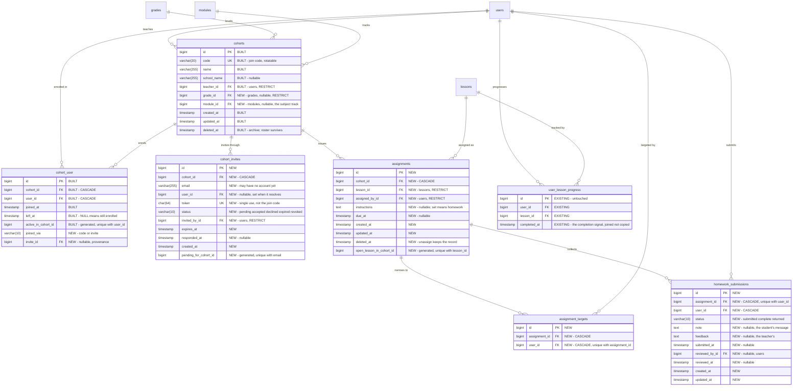
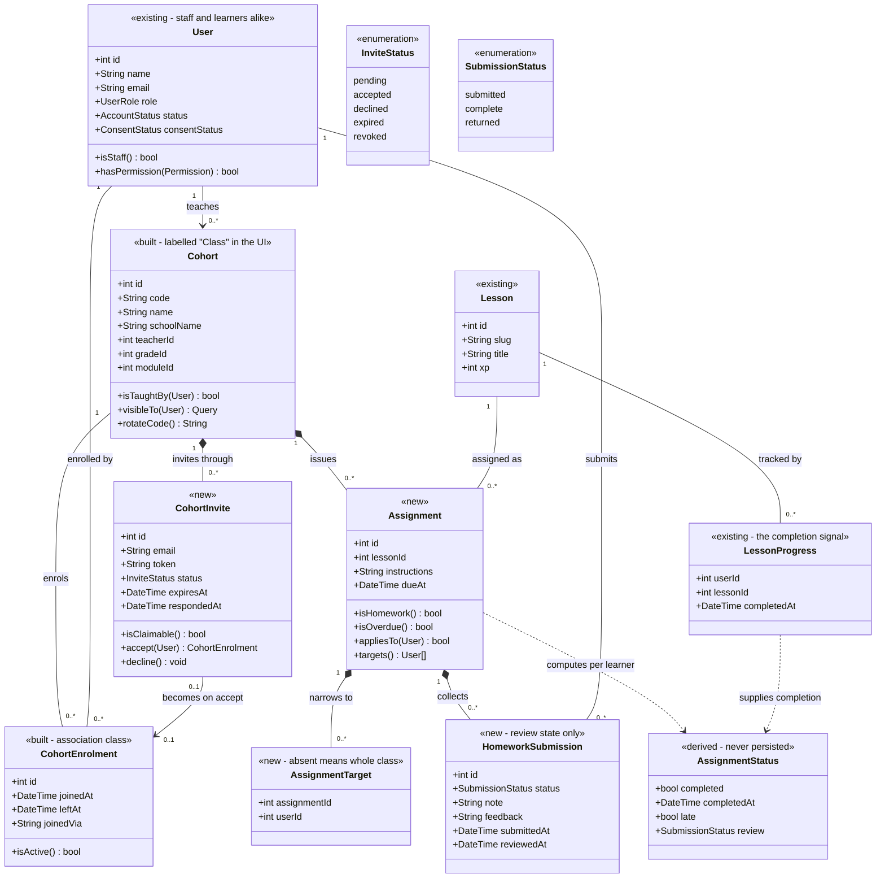
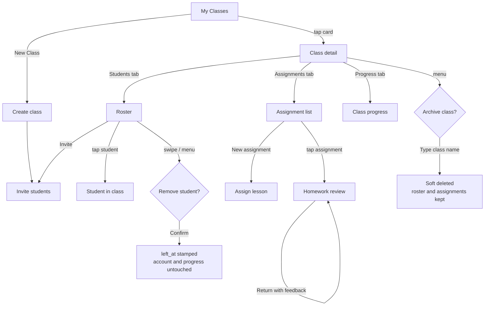

# Code4Youth — the Teacher role

**Design v4 — built, both sides.** Classes, invitations, assignments and
homework review, with a teacher console and learner screens in the Flutter app.

Everything in this document is implemented. The API is covered by
`api/tests/Feature/Teacher/` (176 Laravel tests) and the client by
`test/teacher_test.dart`, `test/teacher_screens_test.dart`,
`test/student_classes_test.dart` and `test/deep_links_test.dart` (231 Flutter
tests). Where this document
and the code disagree, the code is right and this document is what needs
fixing — the same rule [`backend-contract.md`](backend-contract.md) carries, for
the same reason.

**Three things changed during implementation**, each because building it
surfaced something the design had wrong:

1. **The teacher-side "enrol this learner" endpoint was removed.** The
   specification requires that students accept before joining, and a teacher
   who can add someone by email routes around that. Enrolment is now only ever
   the student's act — a code they typed or an invitation they accepted.
   Withdrawal stays one-sided, which is the correct asymmetry.
2. **Every API 404 now renders an identical body.** A test asserting that
   "another teacher's class" is indistinguishable from "no such class" failed:
   route-model-binding 404s name the model and id, while `abort(404)` does not.
   The difference was enough to tell the two apart, which is the exact thing
   the 404 was chosen to hide. Fixed in `bootstrap/app.php`.
3. **Withdrawing a learner who was never in the class is a 404, not a 409.**
   The 409 message named them, which made the endpoint a way to look up any
   user id and get a real name back. Scoped route binding now refuses it before
   the controller runs.

---

## Before building: six things I would change in the brief

The brief is sound on the part that matters most — ownership scoped at the
query level rather than hidden in the UI — and the "must not" list is specific
enough to write negative tests straight from. Six changes, in descending order
of how much trouble they save.

### 1. `Class` cannot be the model name

`class` is a reserved word in both PHP and Dart. `class Class {}` is a fatal
parse error in PHP, and Dart rejects it the same way. Every workaround is ugly:
`SchoolClass`, `Klass`, `ClassModel`.

**Recommendation: keep `Cohort` as the internal name and label it "Class"
everywhere a human reads it** — screen titles, buttons, notification copy. The
table is `cohorts`, the model is `Cohort`, the UI says "My Classes". This costs
one line in a glossary and saves a name collision in two languages. It also
means the built teacher API needs no rename.

### 2. Assignment completion should be derived, not stored

This is the most important change in this document.

The brief lists `Assignment` and `HomeworkSubmission` as separate entities, with
submissions carrying completion state. But `user_lesson_progress` already holds
exactly one row per `(user_id, lesson_id)` with a `completed_at` timestamp, and
`lesson_attempts` is the append-only record with `xp_earned` and `passed`. The
server already grades lesson completion — that is what
`POST /api/lessons/{slug}/complete` does.

If a submission row also records "done", there are two sources of truth for the
same fact, and they will disagree the first time a student completes a lesson
outside the assignment flow. Which they will, because the app's whole design
lets a learner work through the curriculum on their own.

**Recommendation: a submission row stores only what cannot be derived** — the
student's optional note, and the teacher's review decision. Whether the lesson
is done is a join against `user_lesson_progress`, computed at read time. Whether
it was late is that timestamp against `assignments.due_at`.

A consequence worth stating plainly, because it will come up in a demo: a
student who completed the lesson last month and is then assigned it shows as
already complete. That is correct. They did the work.

### 3. One assignment concept, not two

The brief separates "assign lessons" (item 3) and "assign and collect homework"
(item 4). These are the same mechanism with different labels: a lesson, given to
some students, optionally with a due date and optionally with instructions.

**Recommendation: one `Assignment` entity.** "Homework" is an assignment with
`instructions` filled in and a `due_at` set. Two parallel systems would need two
sets of endpoints, two review screens, and would still drift.

### 4. Three invite channels is two too many for one semester

Join code, invite link, and email invite are three distinct pieces of work. The
link needs Flutter deep-linking and an unauthenticated landing route; email
needs a queued mail pipeline and a bounce story.

**Recommendation: ship the join code first.** It covers a teacher standing in
front of a class, which is the actual use. Keep the `invites` table in the
schema from day one so email and link are additive later — but do not build
their delivery in the MVP.

Note also that a join code is *already* an acceptance: the student types it, so
the student consented. The brief's "students must accept before joining" is
satisfied by the code path without a pending state at all.

### 5. Split the join code from the invite token

The brief treats "join code" and "invite code" as one thing. They have opposite
security requirements:

| | Join code | Invite token |
| --- | --- | --- |
| Read aloud to a room | yes | never |
| Entropy | low, human-typable | high |
| Reuse | many students, many times | single use |
| Lifetime | until rotated | short, expires |
| Lives on | `cohorts.code` | `cohort_invites.token` |

**Recommendation: two fields, two purposes.** A low-entropy code is safe only
because it is rate-limited and rotatable; a bearer token in an email must be
neither guessable nor reusable.

### 6. Archive, do not delete

The brief asks for "archive or delete a class". Hard deletion of a class holding
minors' enrolment history is a data-retention decision, not a button.

**Recommendation: one action, soft delete, labelled "Archive".** The roster and
its assignments survive; learners stop seeing the class. If a real delete is
ever needed it belongs to an administrator with a retention policy behind it,
not to a teacher tidying up at the end of term.

### And one thing the brief asks that is already answered

"Can a student behind the guardian-consent gate accept an invite?" does not need
a new rule. `EnsureLearnerIsReady` sits on every learner route except
`GET /api/me`, and it refuses any account that is unverified or waiting on a
guardian. Such a student *cannot call the accept endpoint at all*. The invite
stays pending until consent lands. Nothing to design — just do not accidentally
put the accept route outside that middleware.

---

## 1. Data model

### What is already built

`cohorts` and `cohort_user` exist in the uncommitted teacher API, with the
ownership scope, the withdrawal semantics and the re-enrolment rule the brief
asks for. Everything below marked **NEW** is the work this design adds.

### ERD



**No foreign key joins `homework_submissions` to `user_lesson_progress`.** They
are related by `(user_id, lesson_id)` at read time and deliberately not by a
column — see recommendation 2. A column would be a copy, and a copy is a second
source of truth.

### Three notes on keys

**`assignment_targets` empty means everyone.** "Whole class or selected
students" needs no nullable column and no union: an assignment with zero target
rows applies to every learner currently enrolled, and one with rows applies to
exactly those. The whole-class case — the common one — writes nothing.

**Conditional uniqueness, three times now.** `cohort_user`, `cohort_invites` and
`assignments` all need "at most one *open* row per pair, unlimited closed
history". MySQL 8 has no partial index, so each uses the generated-column device
`guardian_consents` introduced: a virtual column that is NULL unless the row is
open, made unique with its partner. It is the house pattern at this point and
should be written up as such in the ERD appendix.

**`lesson_id` is RESTRICT.** An assignment pins a lesson; a lesson with live
assignments must not vanish underneath it. Curriculum already soft-deletes,
which covers the ordinary case.

### Class diagram



---

## 2. Authorization design

### The invariant

> **A teacher's query never starts from an id. It starts from the teacher.**

Every read and every write begins at the authenticated actor and narrows
downward. `Cohort::find($id)` followed by an ownership check is forbidden — not
because it is insecure when written correctly, but because it is insecure the
one time somebody forgets the second line, and nothing in the codebase makes
that omission visible.

The safe form is already built:

```php
// app/Models/Cohort.php
public function scopeVisibleTo(Builder $query, User $user): Builder
{
    if ($user->hasPermission(Permission::CohortsViewAll)) {
        return $query;               // admin oversight, read-only
    }

    return $query->where('teacher_id', $user->id);
}
```

### Four layers, each doing one job

**Layer 1 — identity.** `firebase` middleware verifies the ID token and
resolves it to a local `users` row. Not `firebase:provision`: staff accounts are
never created as a side effect of a request.

**Layer 2 — capability.** Gates registered from `UserRole::permissions()`. A
teacher holds `console.view`, `cohorts.view`, `cohorts.manage`, and — new for
this design — `assignments.manage`. Notably absent: `users.view`. A teacher
holds no permission over accounts, which is what makes "cannot browse the
student list" a property of the permission table rather than of a screen.

**Layer 3 — ownership, at the query.** Route model binding is scoped so a
nested id cannot be borrowed from another class:

```php
Route::middleware(['firebase', 'throttle:120,1'])
    ->prefix('teacher')
    ->scopeBindings()                       // {assignment} must belong to {cohort}
    ->group(function () { … });
```

`scopeBindings()` makes Laravel resolve `{assignment}` through
`$cohort->assignments()` rather than globally. An assignment id from another
teacher's class 404s at the router, before any controller runs. Combined with
`visibleTo` on the parent, one wrong id cannot reach a controller at all.

**Layer 4 — policy.** `CohortPolicy` and `AssignmentPolicy`, registered
conventionally and called with `$this->authorize()`. Policies express the
ownership rule a second time, deliberately: layer 3 protects the nested case,
layer 4 protects a controller somebody adds later without reading this document.

### The 404 / 403 split

| Situation | Response | Why |
| --- | --- | --- |
| Another teacher's class | **404** | 403 confirms the id exists — enumeration with extra steps |
| Own class, insufficient capability | **403** | The resource is already known to the caller |
| Admin with `cohorts.view_all`, writing | **403** | They can see it; refusing to say so would be theatre |
| Enrolling an unknown or staff email | **404**, identical text | Otherwise every teacher account is an oracle for "is this person registered" |

### Making the invariant enforceable

A rule that lives only in a document decays. Two mechanisms:

1. **An architecture test.** A test that scans `app/Http/Controllers/Api/Teacher`
   for `::find(`, `::findOrFail(`, `::whereKey(` outside a `visibleTo` chain and
   fails on a match. Cheap, and it catches the exact mistake this design is
   built to prevent.
2. **Audit every refusal.** `Gate::after` already writes an `access_denied`
   entry on any failed permission check. A teacher probing another class shows
   up in the log without any new code.

---

## 3. REST API

All teacher routes sit under `/api/teacher` behind `firebase` +
`throttle:120,1` + `scopeBindings()`. **Auth** below is the check beyond those.

### Classes

| Method | Path | Auth | Out-of-scope response |
| --- | --- | --- | --- |
| `GET` | `/teacher/cohorts` | `cohorts.view`, filtered by `visibleTo` | Not applicable — the filter *is* the scope |
| `POST` | `/teacher/cohorts` | `cohorts.manage`; owner forced to caller | `403` if capability missing |
| `GET` | `/teacher/cohorts/{cohort}` | `cohorts.view` + visible | `404` |
| `PATCH` | `/teacher/cohorts/{cohort}` | `cohorts.manage` + **owner** | `404` if invisible, `403` if visible-not-owner |
| `DELETE` | `/teacher/cohorts/{cohort}` | `cohorts.manage` + owner | `404` / `403` — archives, never destroys |
| `POST` | `/teacher/cohorts/{cohort}/code` | `cohorts.manage` + owner | `404` / `403` — rotates the join code |

### Invitations

| Method | Path | Auth | Out-of-scope response |
| --- | --- | --- | --- |
| `GET` | `/teacher/cohorts/{cohort}/invites` | `cohorts.manage` + owner | `404` |
| `POST` | `/teacher/cohorts/{cohort}/invites` | `cohorts.manage` + owner | `404`; `409` if a pending invite exists |
| `DELETE` | `/teacher/cohorts/{cohort}/invites/{invite}` | owner; `{invite}` scoped to `{cohort}` | `404` — revokes |

`POST /invites` creates a row for the address **whether or not an account
exists**, and the response never says which. That is what stops it being a
directory probe, and it also handles inviting a student who has not registered
yet.

### Enrolment

| Method | Path | Auth | Out-of-scope response |
| --- | --- | --- | --- |
| `DELETE` | `/teacher/cohorts/{cohort}/learners/{user}` | `cohorts.manage` + owner | `404`; `409` if not enrolled |

Stamps `left_at`. The account, its progress and its badges are untouched — the
brief's requirement 5, and the reason withdrawal is not a delete.

### Assignments

| Method | Path | Auth | Out-of-scope response |
| --- | --- | --- | --- |
| `GET` | `/teacher/cohorts/{cohort}/assignments` | `assignments.manage` + owner | `404` |
| `POST` | `/teacher/cohorts/{cohort}/assignments` | owner | `404`; `409` if the lesson is already open in this class; `422` on a target not enrolled here |
| `GET` | `…/assignments/{assignment}` | owner, scoped binding | `404` |
| `PATCH` | `…/assignments/{assignment}` | owner | `404` / `403` |
| `DELETE` | `…/assignments/{assignment}` | owner | `404` — soft, keeps submissions |

The `422` matters: `target_ids` naming a learner from another class must be
refused, not silently dropped. Silently dropping teaches nobody anything.

### Homework review

| Method | Path | Auth | Out-of-scope response |
| --- | --- | --- | --- |
| `GET` | `…/assignments/{assignment}/submissions` | owner | `404` |
| `POST` | `…/assignments/{assignment}/submissions/{user}/review` | owner; `{user}` must be a target | `404`; `422` if not targeted |

The submissions payload is computed, not stored: for each targeted learner, the
review row if one exists, joined to `user_lesson_progress` for `completed_at`,
compared to `due_at` for lateness.

### Progress

| Method | Path | Auth | Out-of-scope response |
| --- | --- | --- | --- |
| `GET` | `/teacher/cohorts/{cohort}/progress` | `cohorts.view` + visible | `404` |

Scoped to the class. There is deliberately no endpoint that reads a learner's
activity outside it — the brief's "must not view a student's activity outside
class assignments" is enforced by the absence of a route, which is the only
enforcement that cannot be bypassed.

### Learner side

| Method | Path | Notes |
| --- | --- | --- |
| `GET` | `/cohorts` | The classes the caller is in. Separate from `/assignments` because a learner who joined a class with nothing set yet still belongs to it |
| `POST` | `/cohorts/join` | Body `{code}`. Tight throttle — `10,1` — because it is guessable by construction. `404` on unknown code, `409` if already enrolled |
| `GET` | `/invites` | Pending invites for the caller's email |
| `POST` | `/invites/{token}/accept` | Single use; `410` when expired or already answered |
| `POST` | `/invites/{token}/decline` | Same, records the decline |
| `GET` | `/assignments` | Assignments across the caller's classes, with derived status |
| `POST` | `/assignments/{assignment}/submit` | Optional note; `403` if not targeted |

All of these sit inside `learner.ready`, so a student waiting on guardian
consent cannot reach any of them — recommendation 6's point, made structural.

### How an emailed invitation gets to the app

One unauthenticated web route, and one custom scheme.

| Method | Path | Notes |
| --- | --- | --- |
| `GET` | `/invites/{token}` | The page an invitation email links to. No auth: the token in the URL is the credential. **Shows only** — there is no `POST` here |

Accepting is deliberately not possible on that page. The answer needs the
learner's signed-in account, because the server matches the invitation against
*their* email address — so the page's whole job is to name the class and hand
off to the app via `code4youth://invites/{token}`. A stranger who opens the
link sees a generic page that names nothing, and an expired or answered one
says so rather than pretending.

The app side is three small pieces: an `intent-filter` on the Android activity,
a `MethodChannel` in `MainActivity` that reports the launch link once and
forwards later ones, and `DeepLinkService`, whose entire grammar is
`inviteTokenFrom` — scheme, host and exactly one path segment, or null. A token
that arrives is parked on `AppState` until the shell is mounted, then opens My
classes and is consumed, so one link opens one screen.

---

## 4. Screens and flows

### Screen list

| # | Screen | Contents |
| --- | --- | --- |
| T1 | **My Classes** | Cards: name, grade, learner count, open-assignment count. Empty state → create. FAB: New Class |
| T2 | **Class detail** | Header + tabs: Students, Assignments, Progress |
| T3 | **Create / edit class** | Name, grade, module track, school. On create → T4 |
| T4 | **Invite students** | Join code large and legible with Copy and Rotate; below, invite-by-email with a pending list |
| T5 | **Assign lesson** | Module → lesson picker, optional due date, optional instructions, audience toggle (whole class / choose students) |
| T6 | **Homework review** | One assignment: roster with derived status chips (Not started / In progress / Complete / Late), note if any, mark Complete or Return |
| T7 | **Student in class** | That learner's progress *within this class only*: assignments, completion, streak. No account controls |

### Primary flow



### Confirmation steps

Destructive actions get a confirmation whose text states what *survives*, not
just what is lost — the fear a teacher has when removing a student is deleting
their work, and the dialog should answer it directly.

| Action | Confirmation | Copy |
| --- | --- | --- |
| Remove student | Dialog, name repeated back | "Remove Sokha from Grade 10A? Their account and all their learning progress stay exactly as they are. They lose access to this class's assignments." |
| Archive class | **Type the class name** | "Archive Grade 10A? Students lose access. The roster and assignment history are kept." |
| Delete assignment | Dialog | "Remove this assignment? Any work already completed stays on each student's record." |
| Revoke invite | Inline undo, 5s | Non-destructive; a snackbar is enough |
| Rotate join code | Dialog | "The old code stops working immediately. Students already in the class are not affected." |

Typing the name for archive and not for the others is deliberate: it is the only
one that affects every student at once.

---

## 5. Edge cases

**A student in two classes.** Allowed — uniqueness is per `(class, student)`,
not per student. The consequence worth knowing: progress is global, so
completing lesson 7 satisfies an assignment for it in *both* classes at once.
That is correct and occasionally surprising, so the review screen should say
"Completed 3 Mar" rather than "Submitted to this class".

**A teacher leaves or is removed.** Two things hold this, and the foreign key
is only one of them.

`cohorts.teacher_id` is `RESTRICT`, so a hard delete of a teacher who owns
classes fails loudly instead of orphaning rosters. But `RESTRICT` sees only
hard deletes, and the delete the API actually offers — `DELETE /api/me` — is a
*soft* one, which does not trip it. Left alone, a teacher could close their own
account and leave every class pointing at a row `belongsTo` will not return;
the learners in it would then get a 500 from `GET /api/cohorts`. So
`AccountController` refuses that endpoint for any staff account with a `409`:
staff accounts are closed by an administrator, not from the app.

An admin-side reassignment endpoint is still not built, so the supported paths
are archiving the classes first, or an administrator acting on the database. A
*suspended* teacher keeps their classes and loses access — the account status
check refuses the request; nothing cascades.

**A class archived with assignments open.** Assignments are not cancelled. They
stop appearing in the learner's list because the class is gone from their view,
and the submission rows stay for the record. Un-archiving restores the lot,
which is the argument for soft delete over a cascade.

**A join code reused.** By design — it is meant to be reused by a whole class.
The protections are a `10,1` throttle on `POST /cohorts/join`, an audit entry
per attempt, and rotation. A code that leaked is a rotation, not an incident.

**An invite token reused or expired.** Single use, `expires_at` default 14 days.
Both cases answer `410 Gone` rather than `404`: the token was real, which the
holder already knows, and "this expired" is the actionable message.

**A student declines.** `status = declined`, `responded_at` stamped, no
enrolment. The teacher sees it in the pending list so they stop waiting. They
may invite again — uniqueness covers only *pending* invites, so a declined one
does not block a second ask. Whether repeated invites need a limit is a
safeguarding question worth asking a teacher, not a developer.

**A removed student re-invited later.** A new enrolment row; the closed one
keeps its own `joined_at` and `left_at`. Assignments issued while they were away
are **not** applied retroactively — they were not in the class. If a teacher
wants them, re-assign, which is one tap.

**Three more the brief did not list:**

*A student deletes their account.* `DELETE /api/me` soft-deletes the user;
enrolments and submissions cascade. The class's assignment stays, its target
count drops. Rosters must therefore tolerate a missing learner.

*An assigned lesson is unpublished.* `lesson_id` is `RESTRICT` and curriculum
soft-deletes, so the assignment survives with a lesson learners can no longer
open. The review screen should show "Lesson withdrawn" rather than an error.

*Two teachers invite the same student.* Both succeed. Different classes,
different enrolments. No conflict exists to resolve.

---

## 6. Acceptance criteria

Written as testable statements. The negatives are the ones that matter — they
are what "scoped at the query, not in the UI" actually means.

### Ownership — negative

1. A teacher requesting another teacher's class by id receives **404**, and the
   response body is byte-identical to a request for an id that does not exist.
2. A teacher requesting an assignment id belonging to another class receives
   **404**, even when nesting it under a class they *do* own.
3. A teacher posting a review for a learner who is not a target of that
   assignment receives **422**, and no submission row is written.
4. A teacher creating a class while naming another teacher as owner in the body
   creates a class owned by **themselves**.
5. A teacher assigning a lesson with `target_ids` containing a learner from a
   different class receives **422**, and no assignment is created.
6. Every refusal above writes an `access_denied` audit entry naming the actor.
7. There is no request a teacher can make that returns a learner not currently
   enrolled in one of their classes. Asserted by enumerating every route under
   `/api/teacher` and checking each response body against the caller's roster.

### Capability — negative

8. A teacher calling `GET /api/admin/users` receives **403**.
9. A teacher calling `POST /api/admin/users/{user}/role` receives **403**.
10. A teacher calling `POST /api/admin/users/{user}/status` receives **403**.
11. A teacher has no route by which to change a learner's email, password or
    role. Asserted by route enumeration, not by trying each one.
12. A moderator calling any `/api/teacher` route receives **403** — console
    access is not one permission.

### Function — positive

13. A teacher creates a class and is its owner; `learner_count` is 0.
14. A student entering a valid join code is enrolled, and appears on the roster
    within one refresh.
15. A student entering a rotated (old) code receives **404**.
16. An invited student sees the invite in `GET /api/invites`; accepting enrols
    them, declining does not.
17. An expired invite token answers **410**.
18. A lesson assigned to a whole class appears for every enrolled learner and
    for nobody else.
19. A lesson assigned to two named learners appears for exactly those two.
20. A learner who completed the lesson **before** it was assigned shows as
    complete, with the original completion date.
21. A learner completing the lesson after the due date shows as complete **and**
    late.
22. Marking a submission complete then returned leaves an audit trail of both.

### Removal and retention

23. Removing a learner stamps `left_at`; the `users` row, its
    `user_lesson_progress`, its `lesson_attempts` and its badges are unchanged.
    Asserted by row counts before and after.
24. A removed learner no longer appears on the roster and `learner_count` drops.
25. A removed learner can be re-invited and re-enrolled; both enrolment rows
    exist afterwards and exactly one has `left_at IS NULL`.
26. Archiving a class soft-deletes it, keeps every enrolment and assignment row,
    and makes the class 404 for the teacher and invisible to learners.

### Minors and consent

27. A learner whose `consent_status` is `pending` cannot call
    `POST /api/cohorts/join`, `POST /api/invites/{token}/accept`, or any
    assignment route — `403` with `reason: consent_pending` from
    `EnsureLearnerIsReady`.
28. The roster payload contains no `guardian_email`, no `consent_status` and no
    account `status`. Asserted with `assertArrayNotHasKey`.
29. Inviting an address with no account returns the same response as inviting
    one with an account, and creates a row either way.

---

## Scope: what to build, in what order

The brief asks for one semester of work from a student team. As written it is
closer to two. Suggested cut:

**Phases 1–3 are built** — classes with grade and track, join codes and
rotation, invitations with accept/decline, assignments to a class or to named
learners, derived completion, homework submission and review. 20 teacher routes
and 6 learner routes, behind policies and scoped bindings, with 74 tests in
`tests/Feature/Teacher/`.

**The teacher console is built.** A teacher signs in, lands on the admin
console shell, and sees exactly one section — Classes. The console generates its
navigation from the capability set the server returned, so the role holding
neither `users.view` nor `audit.view` is why the directory and the audit log are
absent, rather than a screen choosing to hide them.

Screens, against section 4's list: class list (T1), class detail with roster,
work and progress tabs (T2), invite students (T4), assign lesson (T5), homework
review (T6), class progress (T6b), and the removal confirmation (T7).

**The learner side is built too.** Three screens, reached from two places:
*My classes* (join by code, answer invitations) hangs off Profile, *My work*
lists everything set across every class, and an assignment detail carries the
teacher's instructions, their feedback, and the way in to the lesson. Home
surfaces the single most urgent piece above the daily goal — a deadline
somebody else set outranks a target the app invented.

Invitations are delivered via email (queued `CohortInvitation` mailable) and
deep links (`code4youth://invites/{token}`). The learner app handles these by
navigating to the My classes screen where the invitation is waiting.

**What is left, in order:**

**Ownership transfer.** A teacher who owns classes cannot be deleted, by
either route — `RESTRICT` blocks the hard one and `AccountController` refuses
the soft one — so classes are never orphaned. The limitation is enforced rather
than silent, which is what the brief asked for. What is missing is the way out
of it: there is no admin endpoint to hand a class to another teacher, so a
departing teacher's classes have to be archived.
